## Лабораторная работа №1
_Разработка графического пользовательского интерфейса (GUI) для языкового процессора_

### Цель работы
Разработать оконное приложение - текстовый редактор с графическим интерфейсом пользователя, который в дальнейшем может быть расширен до полноценного языкового процессора для анализа исходного кода.

### Автор
_Студент(ка): Коробейникова Дарья Романовна\
Дисциплина: Теория формальных языков и компиляторов\
Год разработки: 2026_

### Описание проекта
В рамках лабораторной работы реализовано настольное приложение «Text editor» - специализированный текстовый редактор с графическим интерфейсом пользователя. Программа предназначена для создания, открытия, редактирования и сохранения текстовых файлов, а также содержит отдельную область для вывода результатов работы языкового процессора.

Интерфейс приложения состоит из основного меню, панели инструментов, области редактирования текста и области отображения результатов. Пользователь может изменять размеры окна приложения и соотношение размеров рабочих областей.

На текущем этапе реализован базовый функционал текстового редактора. Пункты меню «Текст» и команда «Пуск» предусмотрены архитектурой программы и будут реализованы на следующих этапах разработки.

### Используемые технологии
Язык программирования: C#\
Фреймворк для GUI: Windows Forms\
Платформа: Microsoft Windows\
Среда разработки: Microsoft Visual Studio 2022\
Формат сохраняемых файлов: .txt

### Инструкция по сборке и запуску

#### Системные требования
Операционная система: Windows 10/11 (x64)\
Для запуска готового приложения: дополнительное ПО не требуется\
Для сборки из исходного кода: .NET 7.0 SDK

#### Запуск готового приложения
Загрузить архив с последней версией из раздела Releases репозитория.\
Распаковать архив в любой каталог.\
Запустить исполняемый файл TextEditor.exe.

#### Сборка из исходного кода
Установить .NET 7.0 SDK.\
Клонировать репозиторий:

> git clone <URL_репозитория>

Выполнить сборку:

> dotnet build -c Release

Перейти в каталог с собранным исполняемым файлом:

> cd bin\Release\net7.0\

Запустить приложение командой:

> TextEditor.exe

### Описание интерфейса и функций

#### Основное меню программы
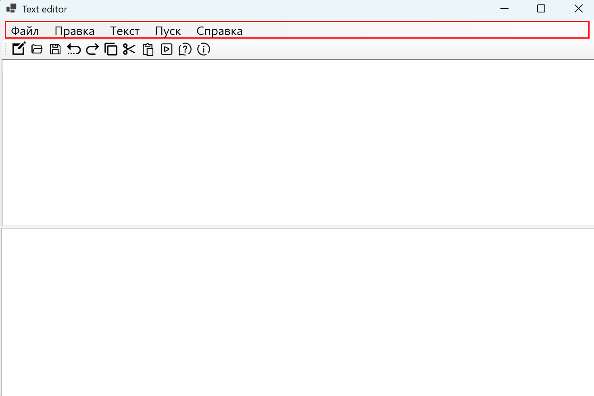

Меню «Файл»:

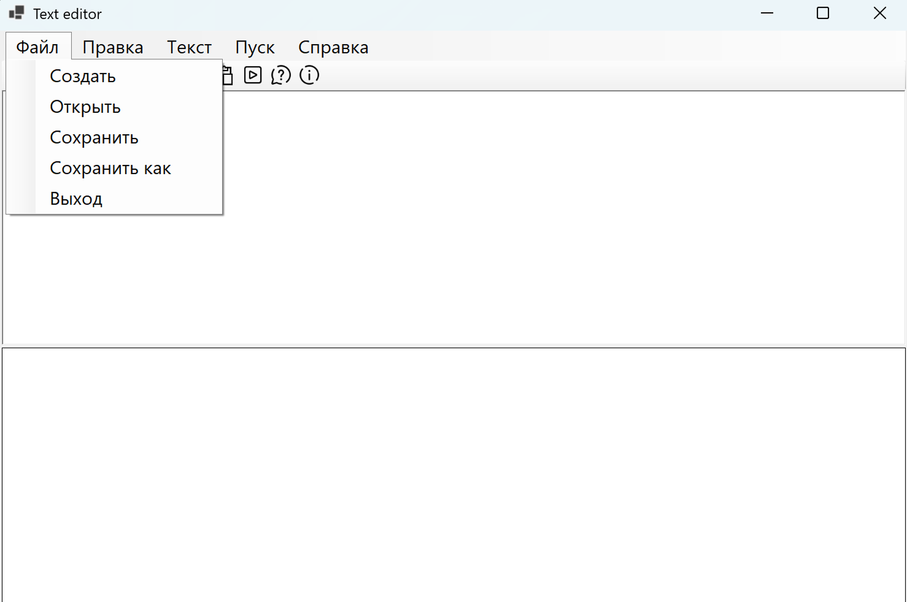

- Создать - создание нового текстового файла.

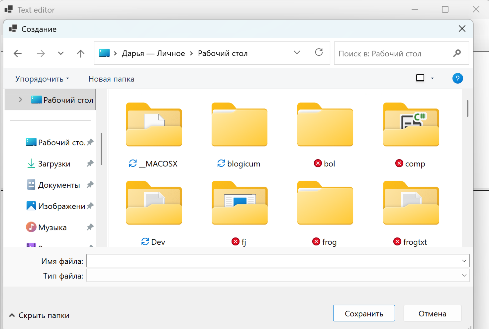

- Открыть - открытие существующего файла с диска.

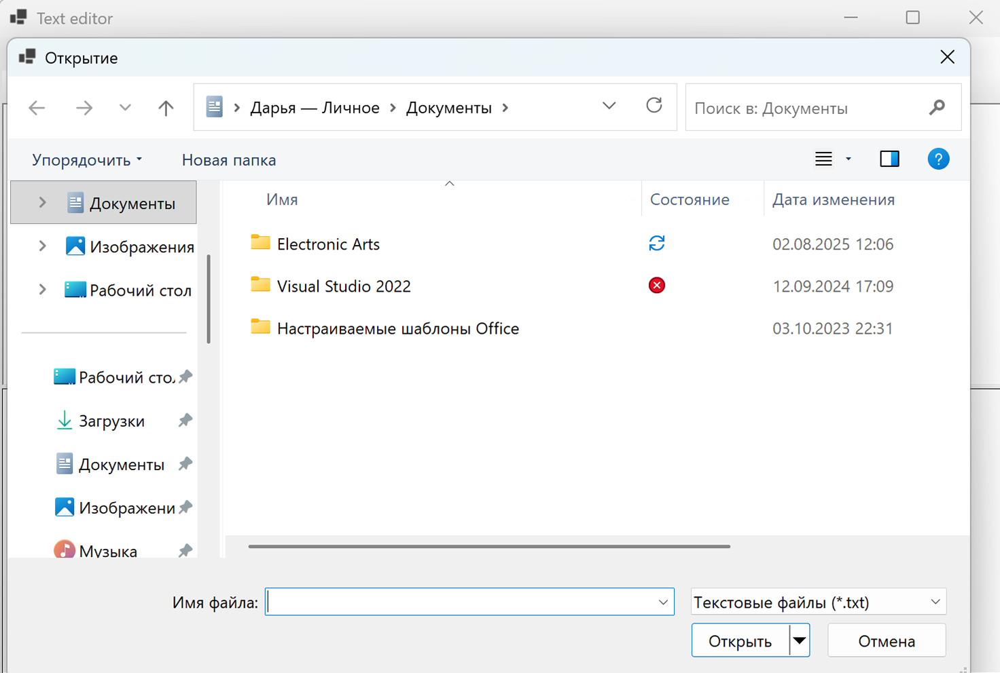

- Сохранить - сохранение текущих изменений.
- Сохранить как - сохранение файла под новым именем.
- Выход - завершение работы программы с запросом на сохранение изменений.

Меню «Правка»:

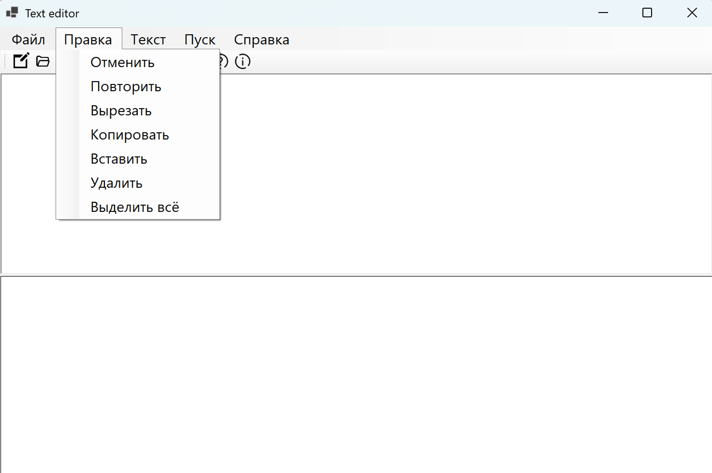

- Отменить - отмена последнего действия.
- Повторить - повтор отменённого действия.
- Вырезать - удаление выделенного текста с помещением в буфер обмена.
- Копировать - копирование выделенного текста в буфер обмена.
- Вставить - вставка текста из буфера обмена.
- Удалить - удаление выделенного фрагмента текста.
- Выделить всё - выделение всего текста в редакторе.

Меню «Справка»:

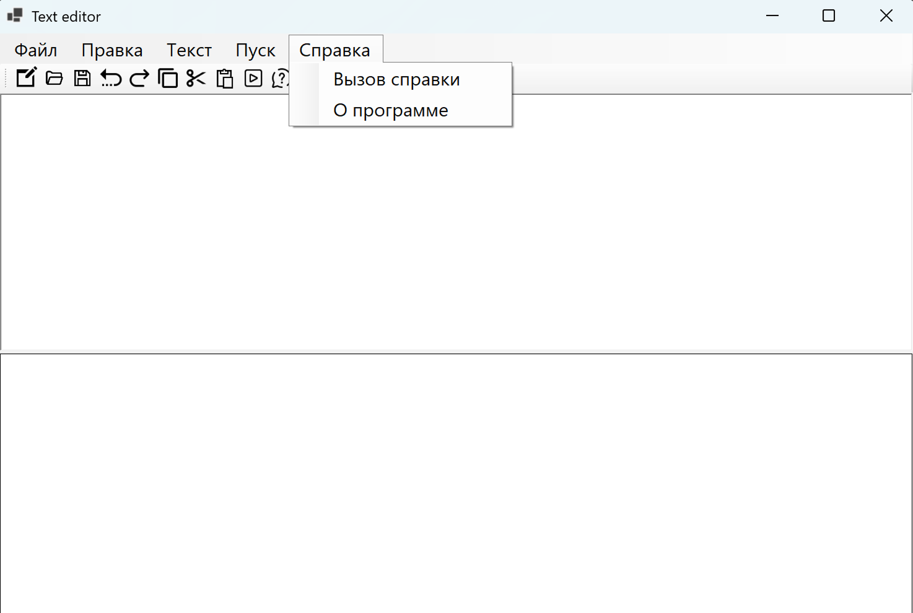

- Вызов справки - отображение справочной информации о реализованных функциях.
- О программе - отображение сведений о программе и авторе.

#### Панель инструментов
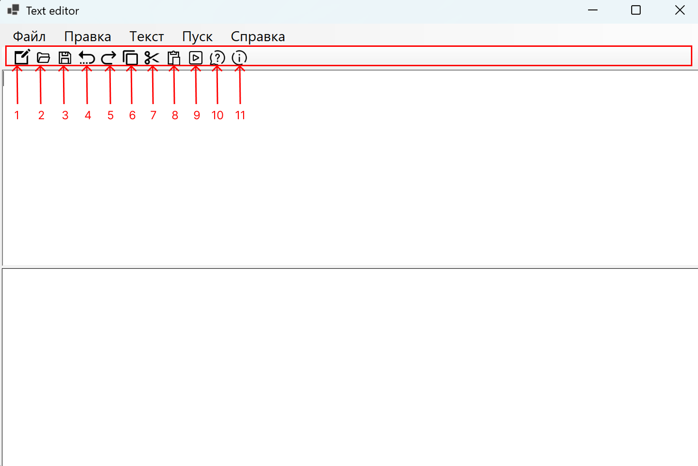

Панель инструментов содержит кнопки быстрого доступа к основным функциям меню:
1 - Создание документа\
2 - Открытие документа\
3 - Сохранение\
4 - Отмена действий\
5 - Повтор действий\
6 - Копирование\
7 - Вырезание\
8 - Вставка\
9 - Запуск анализатора\
10 - Вызов справки\
11 - Вызов информации о программе

#### Область редактирования
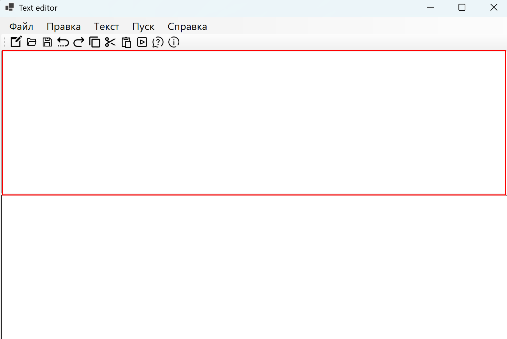

Верхняя часть окна представляет собой текстовый редактор на основе RichTextBox. В этой области пользователь вводит и редактирует текст. Все команды меню «Файл» и «Правка» применяются к содержимому данной области.

#### Область отображения результатов
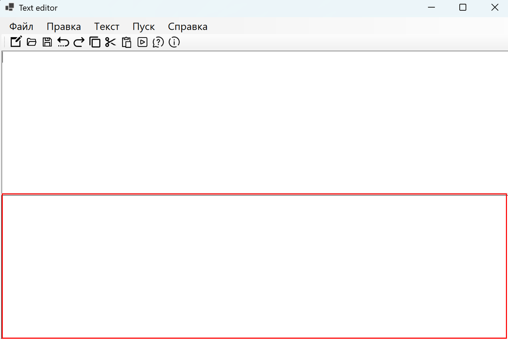

Нижняя часть окна предназначена для отображения результатов работы языкового процессора. На текущем этапе область реализована в виде таблицы DataGridView и доступна только для чтения.

### Ограничения и особенности реализации
- Подсветка синтаксиса и анализ текста не реализованы на текущем этапе.
- Пункты меню «Текст» и команда «Пуск» являются заделом для последующих лабораторных и курсовой работы.
- Поддерживается работа с одним файлом одновременно.

## Лабораторная работа №2
### Разработка лексического анализатора (сканера) для языкового процессора
### Цель работы
Изучить назначение и принципы работы лексического анализатора в структуре компилятора. Спроектировать алгоритм (диаграмму состояний) и выполнить программную реализацию сканера для выделения лексем из входного текста. Интегрировать разработанный модуль в ранее созданный графический интерфейс языкового процессора (лабораторная работа №1).

### Автор
_Студент(ка): Коробейникова Дарья Романовна\
Дисциплина: Теория формальных языков и компиляторов\
Год разработки: 2026_

### Постановка задачи
Разработать лексический анализатор (сканер) в соответствии с индивидуальным вариантом задания, интегрировать его в приложение из лабораторной работы №1 и обеспечить наглядный вывод результатов.

#### Требования к реализации сканера:

Спроектировать диаграмму состояний конечного автомата, реализующего сканер, согласно варианту задания.\
Разработать программный модуль лексического анализа, который:\
принимает на вход строку (исходный текст программы);\
выделяет все допустимые лексемы согласно варианту;\
классифицирует лексемы по типам (ключевое слово, идентификатор, число, оператор, разделитель и т.д.);\
любые символы, не соответствующие ни одному из допустимых типов лексем, считать недопустимыми и выводить сообщение об ошибке с указанием позиции;\
учитывает многострочность входного текста.\

#### Требования к интеграции и интерфейсу:

Встроить сканер в ранее разработанный интерфейс и связать его с кнопкой «Пуск» и соответствующим пунктом меню.\
Область вывода результатов (элемент DataGridView) должна содержать столбцы:\
Условный код (числовой идентификатор типа лексемы);\
Тип лексемы (текстовое описание);\
Лексема (выделенная подстрока);\
Местоположение (номер строки, начальная и конечная позиция символов).\
Реализовать навигацию по ошибкам: при щелчке на сообщении об ошибке в таблице результатов курсор в области редактирования должен устанавливаться на позицию недопустимого символа.\

#### Вариант задания:
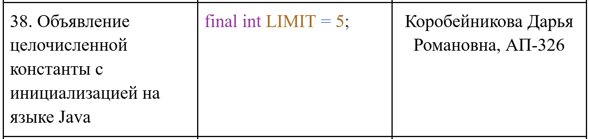

Рисунок 1 - Вариант задания

#### Примеры корректных входных данных
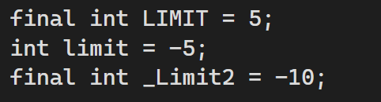

Рисунок 2 - Примеры корректных входных данных

#### Перечень допустимых лексем:
- "letter"
- "digit"
- "whitespace"
- "+"
- "-"
- "="
- ";"

#### Диаграмма Состояний:
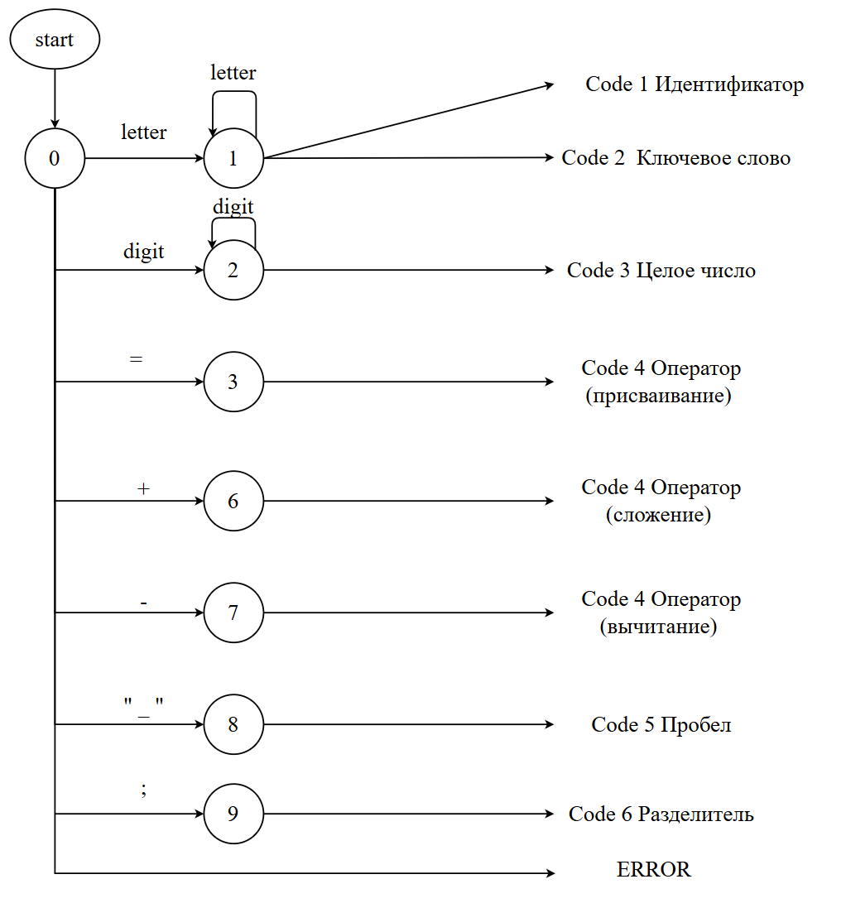

Рисунок 3 - Диаграмма состояний

### Тестовые примеры
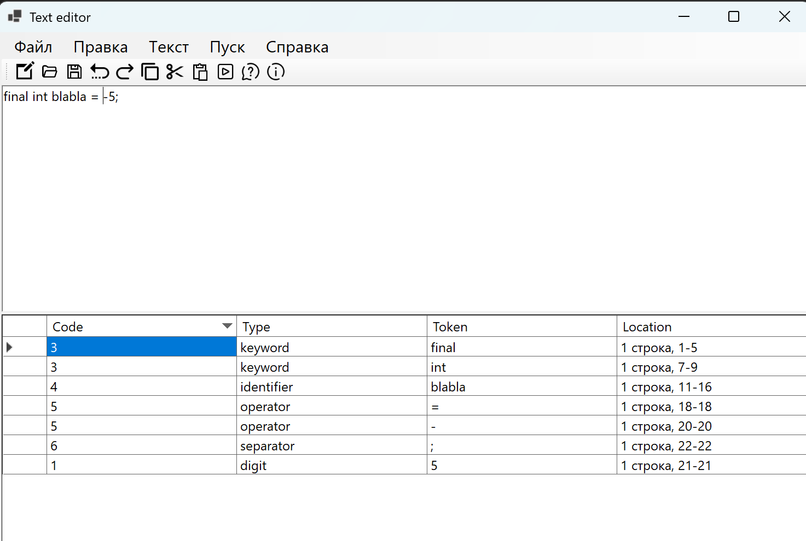

Рисунок 4 - Пример корректной строки

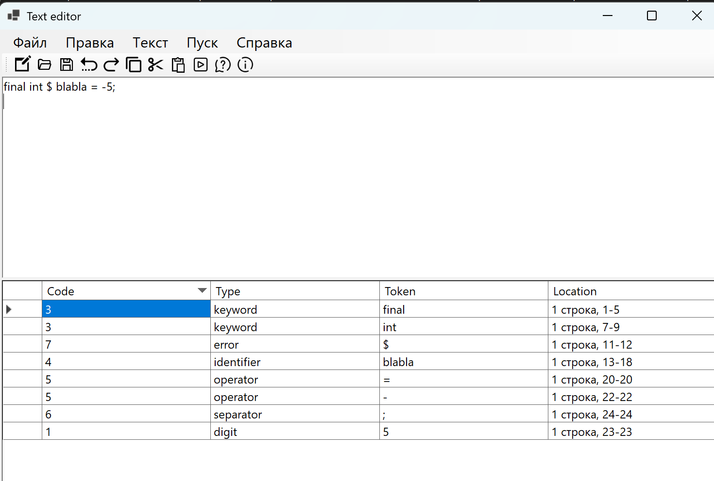

Рисунок 5 - Пример строки с ошибкой

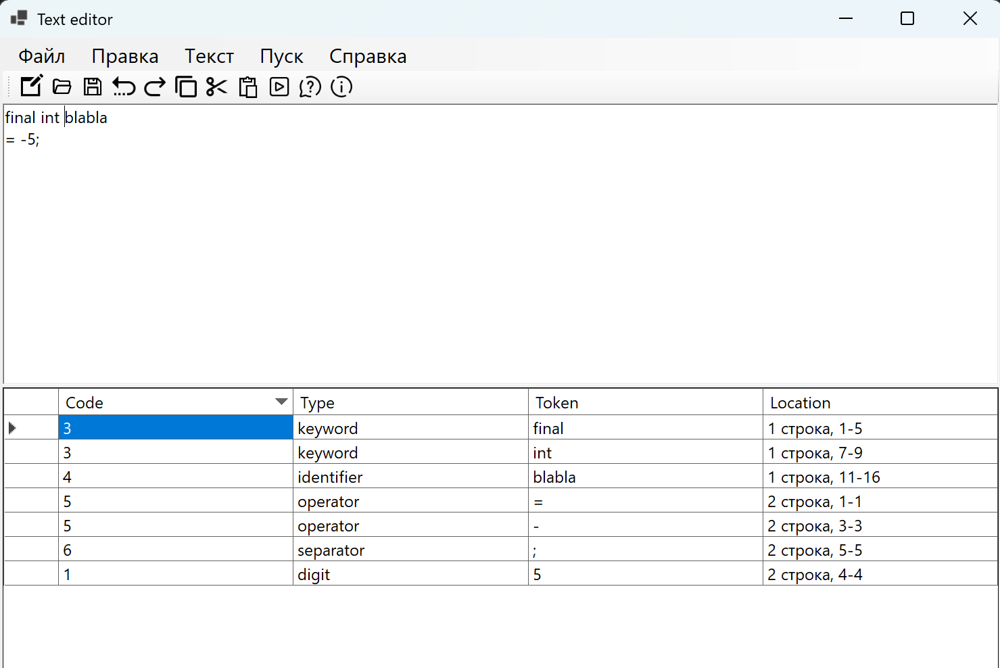

Рисунок 6 - Многострочный пример

## Лабораторная работа №3
Разработка синтаксического анализатора (парсера) для языкового процессора
### Цель работы
Изучить назначение и принципы работы синтаксического анализатора в структуре компилятора. Спроектировать грамматику, построить соответствующую схему метода анализа грамматики и выполнить программную реализацию парсера с нейтрализацией синтаксических ошибок методом Айронса. Интегрировать разработанный модуль в ранее созданный графический интерфейс языкового процессора (лабораторная работа №1).

### Автор
_Студент(ка): Коробейникова Дарья Романовна\
Дисциплина: Теория формальных языков и компиляторов\
Год разработки: 2026_

### Постановка задачи
Разработать синтаксический анализатор (парсер) в соответствии с индивидуальным вариантом курсовой (расчетно-графической) работы, интегрировать его в приложение из лабораторной работы №1 и обеспечить наглядный вывод результатов анализа.

### Требования к разработке парсера:

- Разработать грамматику для заданной синтаксической конструкции.
- Построить схему метода анализа на основе разработанной грамматики.
- Выполнить программную реализацию алгоритма работы синтаксического анализа.
- Реализовать алгоритм нейтрализации синтаксических ошибок методом Айронса.
- Входные данные — строка (текст программного кода) из области редактирования.

### Вариант задания:

Рисунок 1 - Вариант задания

### Примеры корректных входных данных

Рисунок 2 - Примеры корректных входных данных

### Разработка грамматики
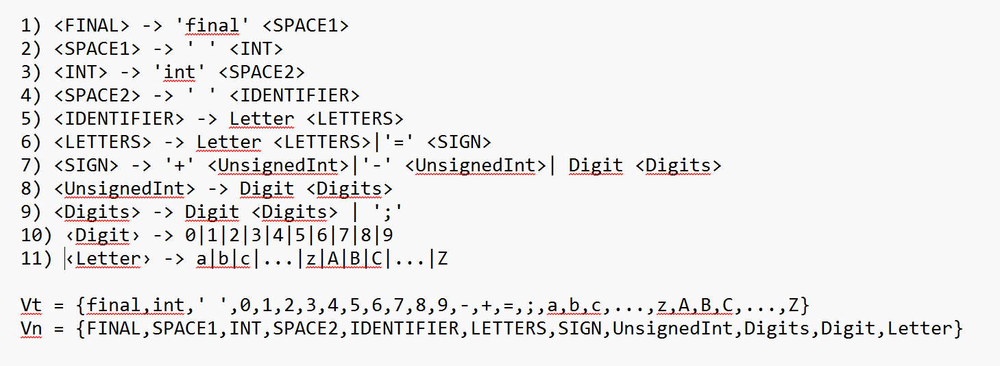

Рисунок 3 - Разработка грамматики

### Классификация грамматики (по Хомскому)
Грамматика относится к автоматной типа 3 по классификации Хомского.

### Метод анализа
Ниже - граф автоматной грамматики

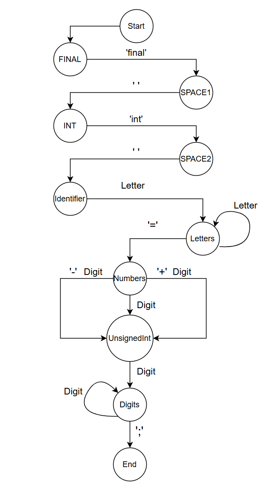

Рисунок 4 - Граф автоматной грамматики

### Тестовые примеры
Пример 1. Корректная строка

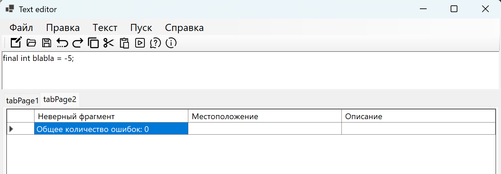

Рисунок 5 – Результат анализа корректной строки

Пример 2. Строка с синтаксической ошибкой

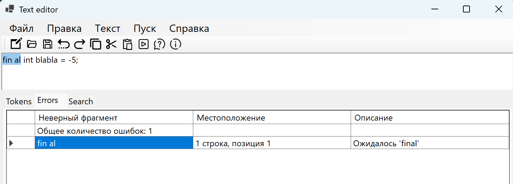

Рисунок 6 – Сообщение об ошибке и навигация к ошибочному фрагменту

Пример 3. Многострочный ввод с несколькими ошибками

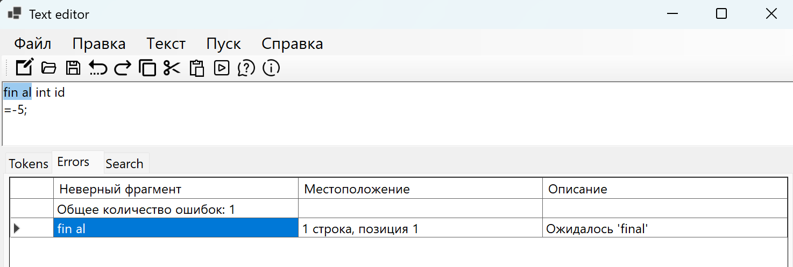

Рисунок 7 – Таблица ошибок после анализа нескольких операторов